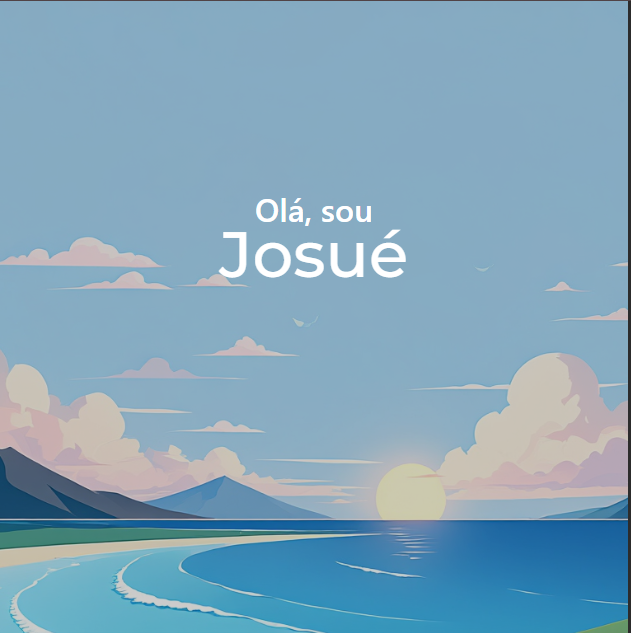

# 💻 Landing Page | Sobre Mim

Este é um projeto de **Landing Page pessoal**, criado com **HTML5, CSS3 e Bootstrap**, com o objetivo de apresentar quem sou, minhas habilidades técnicas e soft skills. A ideia principal é mostrar minha trajetória, tecnologias que domino e meu compromisso com o aprendizado contínuo.

## 🚀 Tecnologias Utilizadas

- HTML5
- CSS3
- [Bootstrap 5](https://getbootstrap.com/)

## 🎯 Objetivo

Este projeto foi desenvolvido com os seguintes propósitos:

- Praticar habilidades com o framework Bootstrap;
- Criar um portfólio leve e responsivo;
- Exercitar boas práticas de HTML semântico;
- Compartilhar um pouco sobre mim e meus valores pessoais e profissionais.

## ✨ Funcionalidades

- ✅ Seção "Sobre mim"
- ✅ Seção "Meus Hobbies"
- ✅ Seção "Habilidades"
- ✅ Seção "Soft Skills"
- ✅ Seção "Consquistas"
- ✅ Design responsivo (mobile-first)

## 📸 Preview

[🔗 Acesse o site clicando aqui](https://josuekla.github.io/Sobre-me-v1.0/)

---

## 👨‍💻 Sobre mim

Me chamo **Josué**. Sou cristão, estudante apaixonado por tecnologia e por transformar a realidade à minha volta com soluções simples, funcionais e com propósito. Este projeto representa uma etapa do meu crescimento como desenvolvedor front-end, alinhando meus princípios, minha vontade de evoluir e minha paixão por criar.

---

## 🧠 Aprendizados

Durante o desenvolvimento, aprendi mais sobre:

- Organização de colunas com o grid do Bootstrap
- Responsividade entre os breakpoints (`lg`, `md`, `sm`)
- Animações com AOS para dar mais vida à experiência do usuário
- Importância de manter o HTML limpo e organizado
- Inspeção de elementos e ajuste de margens indesejadas

---

